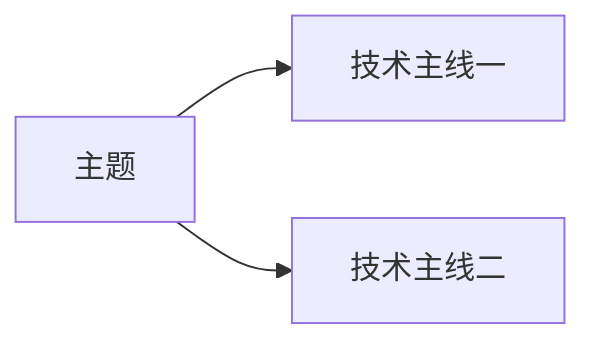
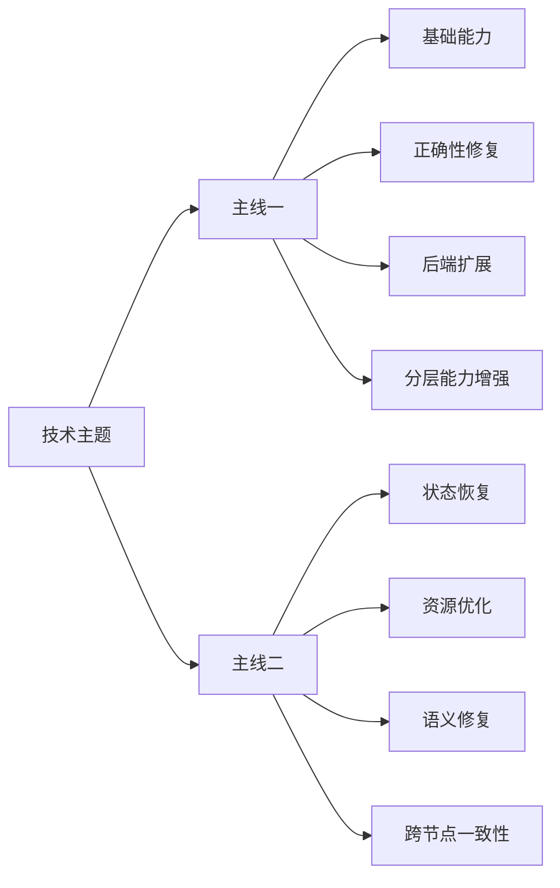

# Source Technology Evolution Research Skill

## Skill ID

`source-technology-evolution-research`

中文名称：**源码技术演进与 PR/MR 关系调研**

---

## 1. 目标

围绕一个技术方向，对 GitHub、GitLab、内部仓库或本地源码中的 PR、MR、Issue、Commit、Release、Benchmark、官方文档和实验分支进行系统调研，形成可用于技术汇报、版本决策和方案评审的中文 Markdown 报告。

报告必须回答：

- 技术主线如何演进；
- 每个改动解决了前序方案遗留的什么问题；
- 各改动之间是依赖、修复、扩展、互补、重叠、替代还是分叉；
- 哪些内容已稳定合入，哪些仍为 Open、Draft 或实验方案；
- 当前用户基线包含哪些能力；
- 各项改动的背景、实现、价值、验证、适用条件和风险；
- 哪些结论是事实，哪些是推断。

---

## 2. 触发场景

用户提出以下需求时使用：

- 调研某个方向的核心 PR/MR；
- 梳理多个 PR/MR 的前后关系；
- 分析某项源码能力的演进过程；
- 比较内部版本与官方分支；
- 总结某个方向的源码改动；
- 形成可汇报的专项技术报告；
- 判断每个改动解决了之前遗留的什么问题；
- 区分 Merged 与 Open 方案；
- 以某个基线判断后续需要补充哪些能力。

不适用于：

- 只需要一个 PR 的简短摘要；
- 只要求生成或修复代码；
- 只解释单个术语；
- 不涉及技术演进、依赖关系或基线的普通问答。

---

## 3. 输入参数

### 必需参数

| 参数 | 说明 |
|---|---|
| `topic` | 调研主题 |
| `repository_scope` | 仓库、项目或资料范围 |
| `baseline` | 当前基线；缺失时必须提醒用户提供 |
| `target_audience` | 报告读者 |
| `depth` | 简要、标准或深入 |

### 可选参数

| 参数 | 说明 |
|---|---|
| `time_range` | 调研时间范围 |
| `model_scope` | 重点模型 |
| `backend_scope` | 网络、存储、推理或计算后端 |
| `deployment_scope` | 单机、多机、PD、CP、TP、DP 等 |
| `hardware_scope` | GPU、NPU 或 CPU 条件 |
| `include_open` | 是否研究 Open/Draft/实验方案 |
| `max_core_items` | 核心节点数量 |
| `source_constraints` | 证据来源约束 |
| `output_filename` | 输出文件名 |
| `special_questions` | 用户特别关注的问题 |

---

## 4. 强制澄清协议

### 4.1 一次只问一个问题

每轮只能提出一个问题。

禁止：

- 一次列出多个问题；
- 一个问题中混合多个独立选项；
- 重复询问已经回答的内容。

### 4.2 问题优先级

按以下顺序选择当前最关键的问题：

1. 调研目标；
2. 仓库范围；
3. 当前基线；
4. 技术边界；
5. 重点模型或后端；
6. 时间范围；
7. Open/实验方案处理方式；
8. 报告深度；
9. 目标读者；
10. 输出文件要求。

### 4.3 基线提醒

若 `baseline` 缺失，必须单独询问：

> 当前希望以哪个分支、Tag、Commit、Release、镜像、内部版本或 PR/MR Head 作为本次调研的基线？

可接受：

- Commit；
- 分支；
- Tag；
- Release；
- Docker 镜像；
- PR/MR Head；
- 内部版本日期；
- 关键代码特征。

### 4.4 停止澄清条件

当以下信息明确时，可认为理解程度达到约 95%：

- 能准确复述用户目标；
- 调研边界明确；
- 基线明确或已说明缺失；
- Open 内容处理规则明确；
- 报告结构明确；
- 输出文件要求明确；
- 证据标准明确。

达到后：

1. 给出简洁任务理解摘要；
2. 不再要求重复确认；
3. 直接开始调研。

---

## 5. 工具适配模式

### 5.1 通用模式

适用于仅有网页搜索或用户上传资料的环境：

- 读取 PR/MR 页面；
- 读取官方文档与 Release；
- 阅读用户提供的 Markdown、Diff、Patch 或源码；
- 无法确认基线关系时明确标记“无法确认”。

### 5.2 仓库连接模式

具备 GitHub/GitLab Connector 时：

- 获取 PR/MR 状态、Head、Base、Merge Commit；
- 获取改动文件；
- 读取关键 Patch；
- 读取 Review、Discussion 和 CI；
- 识别 Follow-up、Dependency、替代和重叠关系；
- 比较改动与用户基线。

### 5.3 本地 Git 增强模式

具备本地仓库时：

- 查看目标分支和 Commit Graph；
- 阅读最终源码；
- 比较版本差异；
- 检查 PR 描述与最终实现是否一致；
- 确认是否存在二次改造或等价实现。

默认不生成 Commit 或代码特征校验脚本，除非用户之后明确要求。

---

## 6. 证据分级

| 等级 | 类型 | 示例 |
|---|---|---|
| A | 源码事实 | 实际 Diff、最终代码、Merge Commit |
| A | 官方状态 | Merged、Open、Draft、Release |
| A | 官方验证 | Benchmark、CI、Unit Test、E2E |
| B | 作者说明 | PR 描述、Review 回复、设计说明 |
| B | 官方文档 | Docs、RFC、Roadmap |
| C | 合理推断 | 基于代码路径和依赖的技术推导 |
| D | 第三方观点 | 博客、论坛、社区文章 |
| E | 未验证信息 | 无法找到原始证据 |

输出关键结论时应区分：

- 官方事实；
- 代码事实；
- 作者说明；
- 合理推断；
- 第三方观点；
- 未验证结论。

不得把推断写成事实。

---

## 7. 核心对象筛选规则

优先纳入：

- 建立基础能力的起点；
- 修复关键正确性问题的改动；
- 扩展到新模型、新后端或新部署方式的改动；
- 解决前序遗留性能、容量、一致性或可靠性问题的改动；
- 与当前基线直接相关的改动；
- 被后续方案明确依赖、继承或替代的改动；
- 代表重要分叉或候选路线的方案。

排除：

- 仅格式化、重命名或代码清理；
- 与主题只有关键词重合；
- 无法确认技术关系；
- 重复且没有新增结论；
- 只做依赖升级且无功能变化。

不得以数量为目标，应优先保证核心节点完整。

---

## 8. 状态分层

### 主报告

默认只包含：

- Merged；
- Released；
- 已进入稳定分支；
- 已确认纳入用户基线的内部实现。

### 附录

以下内容放入“Open / Draft / 实验候选方向”：

- Open；
- Draft；
- Experimental；
- 未合并分支；
- CI 未完成；
- 与已合并方案高度重叠的实现。

Open/实验项必须说明：

- 当前状态；
- 最近更新时间；
- CI；
- Review 风险；
- 未测试场景；
- 与已合并实现的重叠；
- 是否适合直接移植；
- 是否可能被替代或拆分。

---

## 9. 技术关系分类

统一使用：

| 关系 | 含义 |
|---|---|
| 起点 | 建立基础能力 |
| 直接修复 | 修复前序明确 Bug |
| 功能扩展 | 扩展到新模型、后端或场景 |
| 性能增强 | 语义基本不变，优化性能或资源 |
| 正确性补全 | 补齐状态、边界条件或一致性 |
| 前置依赖 | 当前改动必须建立在前序之上 |
| Follow-up | 明确声明为后续改动 |
| 互补 | 处理不同问题，可同时存在 |
| 重叠 | 覆盖相似能力，需要比较 |
| 替代 | 后续实现取代前序 |
| 分叉 | 从共同基础形成不同路线 |
| 独立并行 | 同属主题，但无直接依赖 |

判断时必须结合：

- Base；
- PR/MR 描述；
- Review；
- 改动文件；
- 代码语义；
- 后续引用；
- 合并时间；
- 共同基础。

不得仅按编号或时间先后判断。

---

## 10. 基线分析

### 基线字段

报告必须声明：

```text
当前基线：
基线类型：
基线时间：
基线可信度：高 / 中 / 低
判断依据：
```

### 与基线的关系

使用：

- 已包含；
- 未包含；
- 部分包含；
- 等价实现；
- 已被替代；
- 与基线分叉；
- 无法确认。

### 判断优先级

1. Commit/版本历史；
2. 实际代码；
3. Merge/Release 信息；
4. 内部版本说明；
5. 用户描述；
6. 代码特征推断。

证据不足时不得输出确定性结论。

---

## 11. 调研工作流

### 阶段一：任务理解

- 执行单问题澄清；
- 确认基线；
- 确认范围、读者和深度；
- 确认 Open 内容的处理方式。

### 阶段二：候选收集

- 搜索主题关键词；
- 搜索关键类名、参数和后端；
- 追踪 PR/MR 中引用的前序和后续项；
- 查找 Issue、Release、Roadmap 和官方文档；
- 收集状态与验证结果。

### 阶段三：代码核验

- 阅读关键 Diff；
- 确认关键类、字段、状态机和数据流；
- 检查 PR/MR 描述与最终合入代码是否一致；
- 识别初始描述中未最终合入的范围。

### 阶段四：关系建模

构建：

- 基础能力链；
- 正确性修复链；
- 后端扩展链；
- 性能优化链；
- 模型特化链；
- 并行分叉；
- Open 候选路线。

### 阶段五：基线映射

判断每项改动与基线的关系：

- 已包含；
- 未包含；
- 部分包含；
- 等价实现；
- 替代；
- 分叉；
- 无法确认。

### 阶段六：报告生成

按固定结构生成中文 Markdown。

### 阶段七：质量审查

检查并修正：

- 错误串行关系；
- 状态错误；
- 性能结论夸大；
- 测试条件缺失；
- 把推断写成事实；
- Open 内容混入主报告；
- 基线判断缺少依据。

---

## 12. 单项分析模板

```markdown
## N. <编号>：<标题>

链接：

状态：

所属技术主线：

与前序方案的关系：

### 背景问题

说明旧流程、触发条件、现象和影响。

### 核心修改

```text
旧流程
    ↓
问题点
    ↓
新流程
    ↓
最终效果
```

### 修改前后示例

使用 Token、Slot、Page、Rank、Layer、Request 或状态示例解释；不适合时可以省略，不得编造。

### 解决的前序遗留问题

说明前序已解决什么、仍缺什么、本次如何补齐。

### 技术价值

区分：

- 性能；
- 正确性；
- 稳定性；
- 容量；
- 可扩展性；
- 工程维护。

### 公开验证结果

| 条件/指标 | 修改前 | 修改后 | 变化 |
|---|---:|---:|---:|

无量化数据时写明：

> 未公开量化性能结果，当前证据主要为正确性测试、CI、Unit Test 或 E2E。

### 适用条件

列出模型、参数、后端、并行策略、硬件、部署方式、不兼容项和未覆盖场景。

### 风险与限制

列出 TODO、CI 缺失、Review 风险、未测试场景、方案重叠和生产风险。

### 与当前基线的关系

使用统一状态，并说明判断依据和可信度。
```

---

## 13. 固定报告结构

```markdown
# <主题> 核心技术演进调研报告

## 0. 调研范围与当前基线

- 调研主题
- 仓库/项目
- 时间范围
- 当前基线
- 重点模型/后端/部署场景
- 证据边界
- 结论可信度

## 1. 技术主线总览



## 2. 核心关系总表

| 编号 | 状态 | 主线 | 与前序关系 | 前序遗留问题 | 本项解决内容 | 与基线关系 |
|---|---|---|---|---|---|---|

## 3. 技术主线一

### 3.1 关系总表

### 3.2 核心节点详解

## 4. 技术主线二

### 4.1 关系总表

### 4.2 核心节点详解

## 5. 跨主线关系

说明互补、独立并行、重叠、替代和完整生产组合。

## 6. 对当前基线的影响

| 项目 | 与基线关系 | 影响 | 建议 |
|---|---|---|---|

## 7. 总体结论

总结技术演进、成熟能力、未解决问题、对用户场景最重要的改动和后续方向。

# 附录 A：Open / Draft / 实验候选方向

| 编号 | 状态 | 候选价值 | 与已合并方案关系 | CI/测试 | 风险 | 建议 |
|---|---|---|---|---|---|---|

# 附录 B：证据与可信度说明

| 结论 | 证据类型 | 来源 | 可信度 | 备注 |
|---|---|---|---|---|
```

---

## 14. 图表规范

至少提供一张 Mermaid 总览图。

推荐结构：



要求：

- 突出起点、修复、扩展和 Follow-up；
- 并行方案不得画成严格串行；
- Open 候选应使用独立分支或附录表示；
- 关系表必须写出前序遗留问题；
- 不同测试条件的 Benchmark 不得混合排名。

---

## 15. 写作规范

- 使用中文 Markdown；
- 保留必要英文术语；
- 先讲问题，再讲修改；
- 使用具体例子解释抽象逻辑；
- 明确区分性能优化与正确性修复；
- 不机械复制 PR/MR 描述；
- 不因为已合并就默认适合生产；
- 不因为 Open PR 有优秀数据就忽略 CI 和成熟度风险；
- PR 初始描述与最终代码冲突时，以最终代码为准；
- 默认不输出 Commit/代码特征校验脚本；
- 最终报告应可直接用于技术汇报、方案评审和版本决策。

---

## 16. 质量门禁

### Gate 1：任务理解

- [ ] 已达到约 95% 理解；
- [ ] 已明确基线；
- [ ] 已明确主报告和附录边界。

### Gate 2：资料完整性

- [ ] 已读取核心 PR/MR 描述；
- [ ] 已读取关键 Diff；
- [ ] 已检查 Review 或 Discussion；
- [ ] 已收集官方验证；
- [ ] 已确认状态。

### Gate 3：关系正确性

- [ ] 没有仅按编号排序；
- [ ] 已识别直接依赖；
- [ ] 已识别并行互补；
- [ ] 已识别重叠、替代和分叉；
- [ ] 已说明前序遗留问题。

### Gate 4：证据可靠性

- [ ] 事实有一手资料；
- [ ] 推断已标明；
- [ ] 性能数据包含测试条件；
- [ ] 无数据时未编造。

### Gate 5：基线判断

- [ ] 每个核心节点都有基线关系；
- [ ] 判断依据明确；
- [ ] 无法确认时已降级表达。

### Gate 6：输出结构

- [ ] 有 Mermaid 主线图；
- [ ] 有关系总表；
- [ ] 有逐项详解；
- [ ] 有跨主线关系；
- [ ] 有总体结论；
- [ ] Open 内容位于附录；
- [ ] 无 Commit/代码特征校验脚本。

---

## 17. 异常与降级策略

### 无法访问内部仓库

说明：

- 可访问资料；
- 缺失资料；
- 当前有限结论；
- 需要用户补充的 Diff、Commit、文件或截图。

### 基线未知

继续按“一次一个问题”提醒用户提供。

若最终仍无法提供：

- 将基线可信度标为低；
- 不做确定的“已包含/未包含”判断；
- 使用“可能包含”或“无法确认”。

### PR/MR 已删除或私有

使用：

- Commit；
- Release Note；
- 用户上传 Diff；
- Fork；
- Review 截图；
- 内部报告。

并说明证据限制。

### 描述与代码冲突

以最终代码为准，并写明：

> 初始描述与最终合入范围存在差异，以下分析以最终代码为准。

### 多个方案重叠

增加对比表：

| 方案 | 共同基础 | 关键模块 | 能力范围 | 状态 | CI | 风险 | 建议 |
|---|---|---|---|---|---|---|---|

### 缺少 Benchmark

明确写：

> 当前只有正确性、Unit Test 或 CI 证据，没有公开量化性能数据。

不得自行推算收益。

---

## 18. 推荐开场

触发该 Skill 后，先读取用户已提供的全部信息，再提出一个最关键的问题。

基线缺失时优先询问：

> 当前希望以哪个分支、Tag、Commit、Release、镜像或 PR/MR Head 作为本次调研的基线？

基线已知时，询问下一个尚未明确的高价值问题。

---

## 19. 完成标准

满足以下条件才算完成：

1. 用户目标已准确理解；
2. 技术主线清晰；
3. 核心节点选择有依据；
4. 关系总表能说明前序遗留问题；
5. 每项改动包含背景、修改、价值、验证和适用条件；
6. Merged 与 Open 内容正确分层；
7. 基线关系有明确判断；
8. 事实、推断和未验证内容已区分；
9. 输出为结构完整的中文 Markdown；
10. 未生成 Commit/代码特征校验脚本；
11. 报告可直接用于技术汇报或版本决策。
